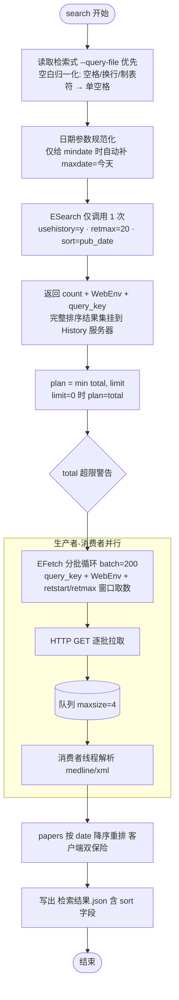
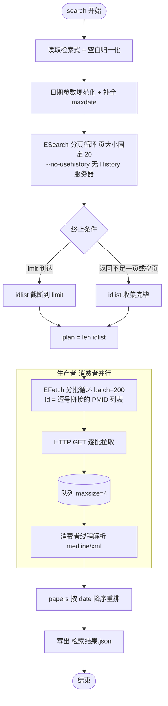

# medlit-search

医学文献检索与筛选工作流 · Medical literature search & screening workflow（当前支持 PubMed；可生成知网/万方/维普检索式供手工检索）

一套**既可独立作为命令行工具、也可作为 [WorkBuddy](https://www.workbuddy.cn/) AI 助手技能**使用的医学文献工作流：
从课题出发，完成 PICOS 分析 → 检索策略（PubMed + 中文平台，LLM 发散同义词并逐个说明原因）→ 纳入排除标准制定 → PubMed 检索（默认按发表日期降序，最新在前）→ 多源合并去重 → 摘要初筛（依据纳排标准）→ 全文复筛与证据地图 → 多格式导出的完整闭环。

检索流程移植自作者的桌面文献检索工具 **SciSearch**（C#/F#），并对其中解析与 API 语义问题做了修正。

## 功能与亮点

medlit-search 是一套**既可独立作为命令行工具、也可作为 [WorkBuddy](https://www.workbuddy.cn/) AI 助手技能**使用的医学文献检索与筛选工作流，覆盖从课题到导出的完整闭环。

**六步逐步中断式工作流**（详细协议见 `SKILL.md`；每步执行完即停止等待用户确认，中间产物可随时人工编辑）：

| 步骤 | 触发 | 产物 |
|---|---|---|
| 1 PICOS 分析 | 课题描述 | `01-PICOS分析/PICOS分析.md` |
| 2 检索策略 | "确认PICOS，继续生成检索式" | `02-检索策略/检索策略.md` + `PubMed检索式.txt` + `纳入排除标准.md` + 知网/万方/维普检索式 |
| 3 执行检索 | "确认检索式，开始检索" | `03-检索结果/检索结果.json` / `.csv` |
| 4 初筛 | "开始初筛"（可附任意来源文献） | `04-初筛/初筛审查表.csv` + `初筛结果.json` |
| 5 复筛（通读全文） | 追加复筛要求 | `05-复筛/复筛报告.md`（含证据地图）+ `复筛结果.csv` |
| 6 迭代更新 | 新检索式 / 新增文献 | 原步骤文件夹内以 `_revN` 后缀另存，不覆盖旧版 |

**防模型惯性偏倚的工作流约束**：

- **研究参数每次重新确认**：研究类型（S）、时间范围、检索数量上限只依据本次题目与对话判断；题目没说明的逐一询问用户，不沿用既往偏好、不自行默认 RCT/Meta；
- **中文分步目录**：每步产物放入 `01-PICOS分析/`、`02-检索策略/`、`03-检索结果/`、`04-初筛/`、`05-复筛/`，项目名/文件夹名/文件名全中文；
- **同义词发散留痕**：检索式中的每个发散词在 `检索策略.md` 的同义词来源表里注明类别与加入原因（商品名/缩写/俗称/变体/上位词），提升命中率；
- **纳排标准先行**：第 2 步同步生成 `纳入排除标准.md`，第 4/5 步筛选以此为依据，复筛新要求先回填该文档再执行；
- **默认最新在前**：`pubmed.py search` 默认 `--sort pub_date`（NCBI 官方按发表日期降序取值，usehistory 下顺序保留），脚本再做一次客户端降序双保险。

**检索与解析能力**：

- `pubmed.py`：PubMed ESearch/EFetch 检索与按 PMID 拉取、MeSH 主题词校验；检索式空白归一化为空格后编码为 `+`，超 500 字符自动改 HTTP POST；
- `import.py`：`--format auto` 自动识别 json/csv/xlsx/ris/bibtex/medline，中文表头自动映射；
- `merge.py`：多来源文献（PubMed 结果 + RIS/BibTeX/MEDLINE + CNKI/万方/维普导出的 CSV/XLSX + 目录）汇总，按 DOI→PMID→标题+年份去重；
- `screen.py`：`prepare` / `apply` 两模式，生成待填审查表并回填初筛/复筛决策；
- `fulltext.py`：索引用户提供的全文文件 + Unpaywall 合法 OA 补全，产出全文清单供复筛；
- `export.py`：RIS / BibTeX / GB/T 7714 / CSV / XLSX 多格式导出；
- `download.py`：PMC 开放获取原文下载。

**高性能 IO**：`pubmed.py`、`download.py`、`fulltext.py` 的 IO 路径基于 `asyncio` 协程（信号量限在途并发 + `asyncio.to_thread` 包装阻塞 HTTP），不引入第三方依赖。

> **推荐从 `v1.6` 稳定标签安装**（见下方"稳定版本"一节）。

## 稳定版本

**请从 `v1.6` 稳定标签（tag）安装**，`main` 分支为开发分支，可能包含未充分验证的改动；`v1.6` 与更早的稳定标签（`v1.5` / `v1.4`）已锁定，禁止移动或删除。

```bash
# 用户级（推荐）
git clone -b v1.6 https://github.com/SloneWang/medlit-search.git \
    ~/.workbuddy/skills/medlit-search

# 项目级
git clone -b v1.6 https://github.com/SloneWang/medlit-search.git \
    <你的项目>/.workbuddy/skills/medlit-search
```

WorkBuddy 技能安装入口直接填：`https://github.com/SloneWang/medlit-search.git@v1.6`

## 快速开始（命令行）

```bash
# 1. 检索（检索式写入文件可避免 shell 引号问题；默认按发表日期降序，最新在前）
echo '("Heart Failure"[MeSH Terms]) AND "SGLT2 inhibitor*"[Title/Abstract]' > "02-检索策略/PubMed检索式.txt"
python scripts/pubmed.py search --query-file "02-检索策略/PubMed检索式.txt" \
    --mindate 2023 --maxdate 2026/09/17 --limit 100 --sort pub_date \
    --out "03-检索结果/检索结果.json"

# 2. 校验术语是否为 MeSH 主题词
python scripts/pubmed.py mesh --terms-file terms.txt --out mesh_check.json

# 3. 多来源汇总 + 去重（可混合文件与目录）
python scripts/merge.py --input "03-检索结果/检索结果.json" cnki导出.xlsx 其它题录/ \
    --out "04-初筛/文献池.json" --csv "04-初筛/文献池.csv" --dedupe-log "04-初筛/去重日志.log"

# 4. 生成待填审查表 → 人工/AI 逐篇填决策（依据纳入排除标准.md）→ 回填
python scripts/screen.py prepare --input "04-初筛/文献池.json" --out "04-初筛/初筛审查表.csv" --round 1
python scripts/screen.py apply   --input "04-初筛/文献池.json" --review "04-初筛/初筛审查表.csv" \
    --out "04-初筛/初筛结果.json" --round 1

# 5. 复筛：准备全文（用户提供 + OA 补全），必须给真实邮箱
python scripts/fulltext.py --input "04-初筛/初筛结果.json" --dir "05-复筛" \
    --provide 我的全文/ --email you@example.org --out "05-复筛/全文清单.csv"

# 6. 导出（任选多种格式）
python scripts/export.py --input "04-初筛/初筛结果.json" --format ris     --out refs.ris
python scripts/export.py --input "04-初筛/初筛结果.json" --format gbt7714 --out refs.txt
python scripts/export.py --input "04-初筛/初筛结果.json" --format xlsx    --out papers.xlsx
```

## 目录结构

```
medlit-search/
├── SKILL.md                  # WorkBuddy 技能定义（六步逐步中断流程）
├── README.md                 # 本文件
├── scripts/
│   ├── pubmed.py             # PubMed 检索 / 按 PMID 拉取 / MeSH 校验（纯标准库）
│   ├── import.py             # RIS/BibTeX/MEDLINE/CSV/XLSX/JSON 导入为统一 JSON
│   ├── merge.py              # 多来源汇总 + 去重（v1.5）
│   ├── screen.py             # 关键词预筛 + prepare/apply 审查表（v1.5）
│   ├── fulltext.py           # 全文准备：用户提供索引 + Unpaywall OA 补全（v1.5）
│   ├── export.py             # 多种格式导出器（xlsx 需 openpyxl）
│   ├── download.py           # PMC 开放获取原文下载
│   └── workflow.py           # 一键导出 all/screening/selected CSV
├── references/
│   ├── medline_fields.md                  # MEDLINE 字段速查
│   ├── mesh_strategy.md                   # MeSH 检索策略构造规则
│   ├── screening.md                       # 初筛/复筛模板（PRISMA）
│   └── inclusion_exclusion_template.md    # 纳入排除标准模板（第 2 步生成用）
└── LICENSE                   # MIT
```

## 检索流程（usehistory 开/关）

`pubmed.py search` 的两种执行路径（v1.6 起 EFetch 各批次以协程任务并发执行，下图画的是控制流程）：

**usehistory = ON（默认）：ESearch 只调 1 次，EFetch 按窗口并发拉取**



**usehistory = OFF（`--no-usehistory`）：分页收集 UID 后再拉取**



两者区别：ON 模式 ESearch **只调 1 次**（结果集整体挂 History 服务器，EFetch 用 `retstart/retmax` 窗口取），OFF 模式要按固定页大小 20 **分页收集 UID** 再以 PMID 列表拉取；OFF 是无状态兜底，用于 History 不可用的兼容降级。

## 技术栈

- Python ≥ 3.10
- 除 XLSX 导出需 `openpyxl` 外，全部功能仅用 Python 标准库
- 代码中所有变量、常量、函数参数/返回值/局部变量、类字段/属性均带有类型注解
- 全部脚本含中文 Google 风格 docstring（参数/返回/异常小节）与核心算法中文注释
- IO 密集型路径（pubmed.py 检索/拉取、download.py、fulltext.py）基于 `asyncio`：
  `Semaphore` 限在途并发、`AsyncRateLimiter` 控请求起步节奏（无 key 3 req/s、有 key 10 req/s）、
  阻塞式 HTTP 经 `asyncio.to_thread` 包装，不引入第三方依赖

## 版本与标签

| 版本 | 说明 |
|---|---|
| `main` | 开发分支；包含最新但可能未充分验证的改动 |
| `v1.6` | **当前稳定标签（推荐安装）**：强制参数确认、中文分步文件夹、默认日期降序、纳排标准、`_revN` 修订机制、固定页大小 20 + 超长检索式自动 POST、IO 协程化；**已锁定** |
| `v1.5` | 早期稳定标签（逐步中断六步工作流 + 多源合并去重/全文准备/审查表）；**已锁定** |
| `v1.4` | 更早稳定标签（全量类型注解，无逐步中断流程）；**已锁定** |

## 更新日志

### v1.6（2026-09-17，已签出 v1.6 稳定标签）

按 09 月周会反馈与工作流实测改进：

- **工作流协议**：研究类型/时间范围/检索数量每次重新确认，题目未说明必须询问，禁止沿用既往偏好；产物按中文分步文件夹组织（`01-PICOS分析/` … `05-复筛/`）；迭代更新不设新文件夹，以 `_revN` 后缀另存、不覆盖旧版；第 2 步同步生成纳入排除标准（新模板 `references/inclusion_exclusion_template.md`），初筛/复筛以此为依据；检索式同义词发散（商品名/缩写/俗称/上位词）并逐词说明来源与原因。
- **检索行为**：`--sort` 默认 `pub_date`（按发表日期降序，最新在前，客户端再降序双保险）；ESearch 页大小固定 `retmax=20`（内部参数，不问用户）；未设日期范围时 `--limit` 须向用户确认（默认 0=无限）；usehistory 模式 ESearch 只调 1 次（结果集整体挂 History 服务器）；检索式空白先归一化为空格再编码为 `+`（换行不再产生 `%0A`）；编码后超 500 字符自动改 HTTP POST；新增 PubMed ESearch 单次 10000 条上限警告。
- **协程化**：`pubmed.py`（search/fetch）、`download.py`、`fulltext.py` 的 IO 路径改为 `asyncio` 协程 + 任务（信号量限并发 + `to_thread` 包装阻塞 HTTP），行为与日志保持兼容。
- **可读性**：全部脚本补中文 Google 风格 docstring 与核心算法中文注释。

### v1.5（2026-09-11）

- 逐步中断式六步工作流（每步产出后停止等用户确认，产物可人工编辑）；
- 新增 `merge.py`（多源汇总 + DOI→PMID→标题+年份 三级去重）、`fulltext.py`（用户全文索引 + Unpaywall OA 补全 + 清单）、`screen.py` `prepare`/`apply` 审查表模式；`import.py` 支持 `--format auto` 与中文表头自动映射。

### v1.4（2026-09 上旬）

- 全脚本补全 Python 类型注解；连续六步流程，无人工确认断点。

### v1.3 / v1.2 / v1.1 / v1.0

- v1.3：参数默认值优化 + 日期自动补全 + limit 提示 + 并行解析 + CSV 审查表导出；
- v1.2：API 语义修正 + XML 解析 + usehistory；
- v1.1：摘要默认导出 + RIS/BibTeX/MEDLINE 导入 + 摘要关键词筛选；
- v1.0：初始发布（2026-08-15）。

## 合规声明

- 遵循 [NCBI E-utilities 使用政策](https://www.ncbi.nlm.nih.gov/books/NBK25497/)：未配 API key ≤3 req/s，配置后 ≤10 req/s，脚本已内置限流。
- 原文下载仅使用合法开放获取渠道（PMC OA / Unpaywall）；非 OA 文献只保存 DOI/PubMed 落地页链接，不绕付费墙。
- 未取得全文的文献，筛选结论须标注"仅基于摘要"。
- 本工具输出仅供科研参考，不构成医学建议。

## License

[MIT](LICENSE) © 2026 王天乐 (Wang Tianle / SloneWang)
